# rl-insight 软件实现设计说明书

> **文档状态**：评审稿  
> **目标系统**：[verl-project/rl-insight](https://github.com/verl-project/rl-insight)  
> **核心目标**：与 verl 解耦，为通用 RL 框架提供可扩展的性能调试与在线监控能力

---

## 1. 引言

### 1.1 项目背景

强化学习（RL）训练流程涉及多阶段（Rollout、Actor、Critic）异构计算的复杂编排，大规模分布式训练场景下，卡间负载不均衡、通信长尾、推理延迟抖动等问题难以通过传统日志手段定位。业界 RL 框架（如 verl）内建的 profiling 工具往往与特定框架紧耦合，缺乏通用性和可扩展性。

rl-insight 的定位是 **RL 训练性能调试与可观测性工具**，核心设计目标：

- **框架解耦**：不依赖单一 RL 框架，通过约定数据契约支持多源 profiling 数据
- **可扩展**：Parser / Visualizer / Pipeline 三级可插拔架构，支持新数据源和可视化能力的高效接入
- **离线 + 在线双模**：覆盖离线事后分析和在线实时监控两大场景

### 1.2 系统范围

| 维度 | 覆盖范围 |
|------|---------|
| 离线分析 | Profiling 数据解析 → 校验 → 可视化（Timeline 甘特图、GMM 热力图） |
| 在线监控 | 跨进程指标采集（Counter/Gauge/Histogram）+ Trace 采集（OTLP Span） |
| 可观测性栈 | Prometheus + Tempo + Grafana 的生命周期管理 |
| 可扩展性框架 | DataRule / Parser / Visualizer / Pipeline 注册与扩展机制 |

### 1.3 术语定义

| 术语 | 定义 |
|------|------|
| Profiler | 性能数据采集器，如 MSTX（Ascend）、Torch Profiler、NVTX（Nvidia） |
| Parser | 将 Profiler 原始数据解析为标准化事件 DataFrame 的组件 |
| Visualizer | 将解析后的标准化数据渲染为可视化产物的组件 |
| Pipeline | 编排 DataChecker → Parser → DataChecker → Visualizer 全流程的调度器 |
| DataRule | 数据校验规则体系，含 DataEnum 类型系统和 ValidationRule 校验链 |
| Monitor Hub | 基于 Ray 的集中式指标收集 Actor，接收各训练进程上报的 metric/trace 事件 |
| OTLP | OpenTelemetry Protocol，Trace 数据导出标准协议 |
| DataMap | Parser 多进程并行时的任务分配单元，描述一个 rank 的数据路径和元信息 |

---

## 2. 需求分析

### 2.1 需求建模

#### 2.1.1 系统上下文

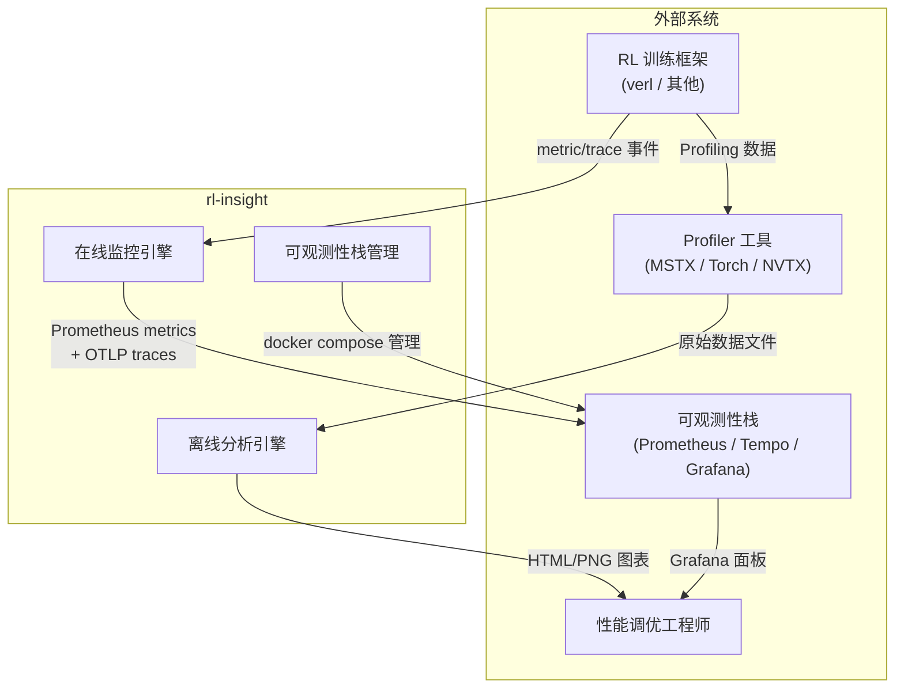

#### 2.1.2 功能需求全景

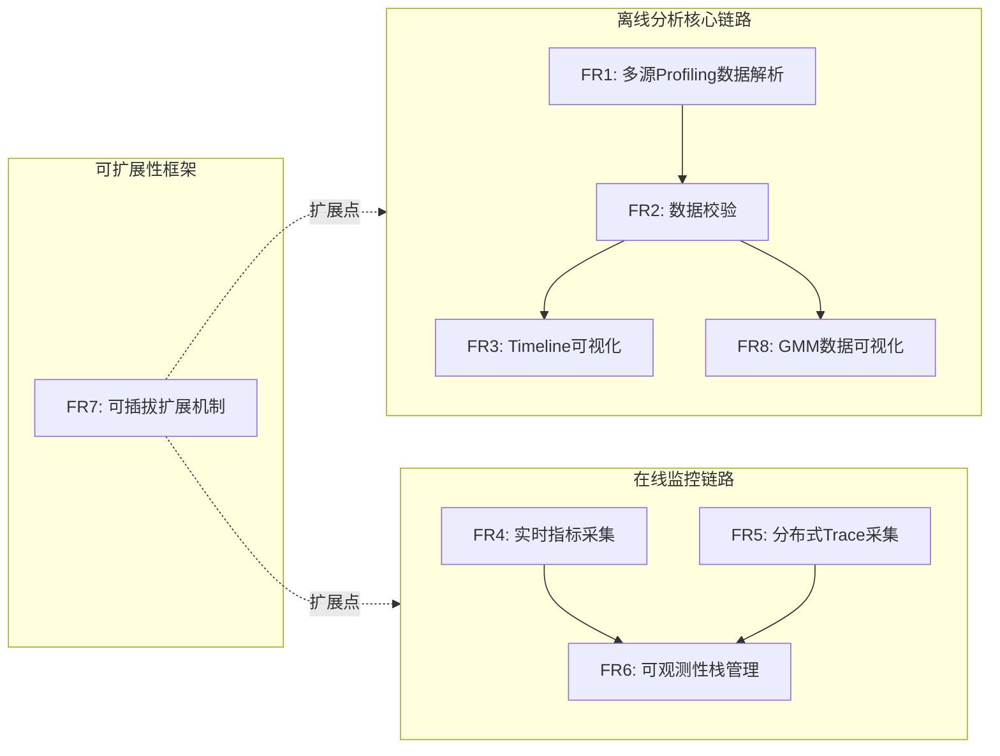

**功能需求清单**

| 编号 | 需求 | 描述 | 优先级 |
|------|------|------|--------|
| FR1 | 多源 Profiling 数据解析 | 支持 MSTX (Ascend)、Torch Profiler、NVTX 三种 profiler 类型的数据解析，输出标准化事件 DataFrame | 高 |
| FR2 | 数据校验 | 对输入数据路径、文件存在性、JSON 字段有效性进行逐层校验，失败时给出精确错误定位 | 高 |
| FR3 | Timeline 可视化 | 生成交互式 HTML 或静态 PNG 甘特图，展示各 Rank 事件的时间分布，支持悬停、排序、缩放 | 高 |
| FR4 | 实时指标采集 | 提供 Counter/Gauge/Histogram 三类 Prometheus 指标的采集 API，支持跨进程上报 | 高 |
| FR5 | 分布式 Trace 采集 | 提供 trace_state/trace_op 上下文管理器/装饰器，自动记录代码块耗时并导出 OTLP Span | 高 |
| FR6 | 可观测性栈管理 | 通过 rl-insight server start/stop 命令管理 Prometheus + Tempo + Grafana 的 Docker Compose 生命周期 | 中 |
| FR7 | 可插拔扩展机制 | Parser / Visualizer / Pipeline / DataRule 均支持通过注册装饰器扩展，新数据源零侵入接入 | 高 |
| FR8 | GMM 数据可视化 | 解析 GMM（Grouped Mixture of Experts）负载数据并生成热力图 | 中 |


#### 2.1.3 需求价值分析

在功能需求建模基础上，进一步分析每条需求的业务价值和工程价值，用于指导后续的优先级排序和资源分配决策。

**价值维度定义：**

| 维度 | 定义 | 评估标准 |
|------|------|---------|
| 用户价值 | 对目标用户（RL 性能调优工程师）日常工作的直接改善程度 | 使用频率、替代方案成本、问题定位效率提升 |
| 架构价值 | 对系统长期演进和可维护性的贡献 | 扩展点数量、耦合降低程度、社区二次开发门槛 |
| 差异化价值 | 与同类工具（如 verl.DistProfiler、PyTorch Profiler Dashboard）的区分度 | 竞品缺口覆盖、独特能力独占性 |

**逐项价值评估：**

| 需求 | 用户价值 | 架构价值 | 差异化价值 | 综合评估 |
|------|:-------:|:-------:|:--------:|:-------:|
| FR1 多源解析 | ★★★ 替代手动逐文件查看 JSON | ★★ 为后续扩展提供标准化数据层 | ★★★ 覆盖三平台，竞品通常仅支持单一平台 | **核心能力** |
| FR2 数据校验 | ★★★ 错误定位精确到字段级，排查从小时级降到秒级 | ★★ 校验链为所有下游模块提供质量闸门 | ★★ 竞品通常仅做黑盒报错 | **刚需能力** |
| FR3 Timeline 可视化 | ★★★ 交互式甘特图直接暴露卡间不均衡 | ★ 可视化层独立不耦合 | ★★ 交互式 + 多 rank 对比能力领先 | **核心能力** |
| FR4+FR5 在线监控 | ★★ 训练中实时发现问题，避免无效训练 | ★★ 打开在线可观测性赛道 | ★★★ 竞品不具备端到端在线监控 | **差异化壁垒** |
| FR6 栈管理 | ★★ 一键启停降低运维门槛 | ★ 与监控模块配套 | ★ 基础设施类需求 | **配套支撑** |
| FR7 可插拔扩展 | ★ 对终端用户间接价值 | ★★★ 决定系统三年内能否持续演进 | ★★★ 同类工具普遍为单体架构 | **架构基石** |
| FR8 GMM 可视化 | ★★ MoE 专家负载分析刚需 | ★ 复用 Parser/Visualizer 框架 | ★★ 竞品未覆盖的细分领域 | **场景拓展** |

**关键洞察：**

- **FR7（可扩展性）的用户价值评级不高但架构价值顶级**——这意味着若仅从用户视角做需求排序，可能被错误地划为低优先级。价值分析的双维度评估揭示了其作为"架构基石"的真实地位。
- **FR4+FR5（在线监控）是差异化壁垒最高的需求**——离线分析能力（FR1+FR3）在竞品中有部分重叠，但端到端在线监控（Trainer 代码注入 → Ray Hub → Prometheus/Grafana）是竞品空白，构成了核心竞争壁垒。
- **FR2（数据校验）的价值被低估**——在 RL 训练场景下，profiling 数据来源碎片化（三个平台、多种采集模式、不同版本），精准的错误定位能力直接决定了工具的可信度。三层校验链的设计使得"首次使用成功率"显著高于「解析失败后靠日志排查」的模式。

### 2.2 架构需求分析

#### 2.2.1 场景分解

通过对典型用户场景的分析，识别架构级质量属性需求：

**场景 S1：离线分析单次 RL 训练**

> 用户在一次 RL 训练完成后，需要查看不同 Rank 的 Timeline 以诊断卡间负载不均衡。

- 输入：训练产出的 profiling 数据目录（可能包含数百个 rank）
- 处理：扫描所有 rank → 并行解析 → 校验 → 生成可视化
- 输出：HTML Timeline 图表
- 质量关注：**性能**（多 rank 并行处理效率）、**可靠性**（单 rank 失败不阻断全局）

**场景 S2：在线监控长时训练**

> 训练运行数小时，用户需要在 Grafana 面板上实时观察各阶段耗时和资源利用率。

- 输入：各训练进程持续上报 metric/trace 事件
- 处理：Ray Actor 集中接收 → Prometheus 暴露 /metrics → OTLP 导出 Trace
- 输出：Grafana 实时面板
- 质量关注：**性能**（跨进程采集低延迟）、**可靠性**（Hub 不丢失事件）、**可扩展性**（支持新增指标类型）

**场景 S3：接入新 RL 框架**

> 第三方 RL 框架需要复用 rl-insight 的可视化能力，但使用不同的 profiling 工具。

- 输入：新 profiler 格式的原始数据
- 处理：注册新 Parser → 复用 DataRule 校验链 → 复用 Visualizer
- 输出：标准化 Timeline 图表
- 质量关注：**可扩展性**（注册即用）、**兼容性**（数据契约稳定）

**场景 S4：监控栈部署**

> 用户首次使用在线监控能力，需要启动本地 Prometheus + Tempo + Grafana。

- 输入：rl-insight server start 命令
- 处理：加载配置 → 启停 Docker Compose → 注册 Prometheus scrape target
- 输出：可访问的 Grafana 面板
- 质量关注：**易用性**（一键启停）、**兼容性**（Docker 环境适配）

#### 2.2.2 场景与质量属性映射

| 质量属性 | S1 离线分析 | S2 在线监控 | S3 新框架接入 | S4 栈管理 |
|---------|:-----------:|:-----------:|:------------:|:--------:|
| 性能 | ● | ● | ○ | ○ |
| 可靠性 | ● | ● | ○ | ○ |
| 可扩展性 | ● | ● | ● | ○ |
| 兼容性 | ● | ○ | ● | ● |
| 安全性 | ○ | ○ | ● | ○ |
| 可测试性 | ● | ● | ● | ○ |
| 易用性 | ● | ○ | ● | ● |

- ● 关键质量属性  ○ 一般质量属性

### 2.3 关键质量属性需求

#### 2.3.1 性能

| 子属性 | 需求描述 | 指标/约束 |
|--------|---------|----------|
| 离线解析吞吐 | 多 rank profiling 数据需并行解析，充分利用多核 CPU | max_workers = min(rank_count, cpu_count) |
| 在线采集延迟 | 训练进程上报 metric/trace 事件应 fire-and-forget，不阻塞训练主循环 | 发送端无 ray.get() 阻塞 |
| Hub 事件吞吐 | MonitorHubActor 需支撑多 trainer 并发上报 | Ray Actor 串行化保证无竞态 |
| 可视化渲染 | 大量事件（万级别）Timeline 渲染应在可接受时间内完成 | Plotly 引擎，懒渲染 |

**跨进程数据采集性能链路分析：**

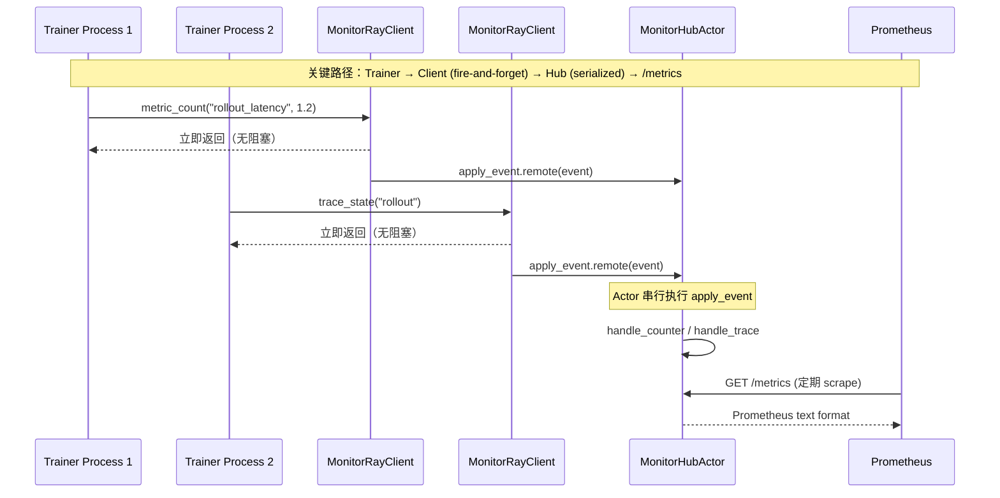


**延迟预算分析（单次 metric_count 调用全链路）：**

| 阶段 | 操作 | 预估耗时 | 备注 |
|------|------|---------|------|
| 1. API 层 | `_emit()` 构造 event dict + 判断 enabled | < 1μs | 纯内存操作 |
| 2. Client 层 | `self._actor.apply_event.remote(event)` | ~100-500μs | Ray 序列化 + 异步投递，无阻塞等待 |
| 3. Hub 队列 | Ray Actor mailbox 排队 | 可变 | 取决于并发 Trainer 数量和 Hub 处理速度 |
| 4. Hub 处理 | `_handle_counter()` → `MetricRegistry.count()` | ~10-50μs | 内存中 Counter 自增 |
| **Trainer 感知延迟** | 阶段 1 + 阶段 2 的同步部分 | **< 1ms** | Fire-and-forget，阶段 3/4 异步对 Trainer 不可见 |

> 关键结论：在 fire-and-forget 模式下，Trainer 侧每次上报感知延迟低于 1ms（主要为 Ray 内部序列化开销），不会对训练吞吐产生可测量的影响。即使每秒上报数百次，GC 压力也远低于 Python 对象分配本底噪声。

**离线解析吞吐量化分析：**

假设条件：128 个 Rank，每个 Rank 的 profiling JSON 文件约 50MB，单 rank 解析耗时约 2s，机器 64 核 CPU。

| 指标 | 串行模式 | 并行模式（max_workers=64） | 加速比 |
|------|---------|--------------------------|--------|
| 总解析耗时 | 128 × 2s = 256s | 128/64 × 2s ≈ 4s + 调度开销 | ~64x |
| 峰值内存 | ~50MB（单文件） | ~64 × 50MB ≈ 3.2GB | — |
| CPU 利用率 | ~1.5%（单核） | ~100%（64 核全部占用） | — |

> 注意：并行度受 `min(rank_count, cpu_count())` 限制，避免 CPU 过度订阅导致的上下文切换开销。单 rank 场景自动走串行快速路径，免除进程池启动开销。

**Hub 事件吞吐边界分析：**

`MonitorHubActor` 为单线程串行 Actor，其吞吐上限由单个 `apply_event` 的处理耗时决定：`_handle_counter` 约 10-50μs，`_handle_trace` 约 50-200μs（含属性规范化和 OTLP BatchSpanProcessor 提交）。在混合负载下，单 Hub 理论吞吐约 5,000-50,000 events/s。对于典型的 RL 训练场景（数十个 Trainer，每个每秒上报数十次），Hub 远未达到瓶颈。
#### 2.3.2 安全性与健壮性

| 子属性 | 需求描述 | 实现策略 |
|--------|---------|---------|
| 输入数据校验 | 拒绝格式错误的 profiling 数据，给出精确错误定位 | 三层校验链：路径→文件→字段 |
| 单点失败隔离 | 单个 rank 解析失败不影响其他 rank | Parser 内 try/except 捕获，记录失败 rank 后继续 |
| 类型安全 | DataFrame 字段校验确保下游消费者数据契约 | ParserOutputValidatorRule 枚举必需列 |
| 重复初始化保护 | monitor.init() 重复调用仅告警不崩溃 | RuntimeWarning + 幂等忽略 |


**RL 场景下的安全性诉求：**

在分布式 RL 训练中，profiling 数据来源多样（不同硬件平台、不同采集工具、不同版本），格式错误是常态而非异常。三层校验链（路径→文件→字段）的设计使得错误定位可以精确到具体文件的缺失字段，避免用户在海量日志中手动排查。单点失败的 try/except 隔离策略尤为重要：128 个 Rank 的集群中，若因 1 个 Rank 的 profiling 数据损坏导致全量解析失败，排查成本将指数级上升。

#### 2.3.3 可靠性

| 子属性 | 需求描述 | 实现策略 |
|--------|---------|---------|
| Hub 持久性 | MonitorHubActor 以 detached 生命周期运行，训练进程退出后 Hub 仍存活 | Ray detached actor |
| 配置降级 | OTLP endpoint 未配置时 trace 采集自动 no-op 而非崩溃 | trace_collector 为 None 时跳过 |
| Ray 未初始化降级 | 未调用 ray.init() 时在线监控自动禁用 | create_monitor_client 返回 None |
| 数据校验前置 | 解析前校验输入，可视化前校验输出，避免垃圾进垃圾出 | DataChecker.run() 在 Pipeline 两阶段各执行一次 |


**RL 场景下的可靠性诉求：**

RL 训练通常是长时运行任务（数小时到数天），监控系统必须具备与训练进程独立的生命周期。`MonitorHubActor` 采用 Ray detached actor 模式，即使所有 Trainer 进程退出，Hub 仍保持存活并持续暴露 `/metrics`。配置降级策略则保证在部分可观测性栈未就绪（如 Tempo 未启动）时，指标采集仍正常工作——只降级 trace 导出，不影响核心指标通路。这一设计避免了「监控系统故障 → 训练中断」的级联风险。

#### 2.3.4 兼容性

| 子属性 | 需求描述 | 实现策略 |
|--------|---------|---------|
| Profiler 类型兼容 | 支持 Ascend (MSTX)、Nvidia (NVTX)、PyTorch (Torch Profiler) 三种硬件平台 | Profiler 类型枚举 + 独立 Parser 子类 |
| RL 框架兼容 | 不依赖特定 RL 框架的内部数据结构 | 约定输入为文件系统路径 + JSON/JSONL 格式 |
| Python 版本兼容 | 最低 Python 3.10 | 类型注解使用新式语法 |
| 导出格式兼容 | 同时支持 HTML（交互式）和 PNG（静态）输出 | Visualizer 独立子类 |


**RL 场景下的兼容性诉求：**

RL 训练生态碎片化严重：不同芯片厂商（Nvidia/Ascend）使用不同的 profiling 工具链，同一厂商不同版本的 profiler 输出格式也可能变化。rl-insight 通过 `input_type` / `profiler_type` 枚举 + 独立 Parser 子类的方式，将平台差异封装在 Parser 内部，对外暴露统一的 `EventRow` DataFrame。新增硬件平台只需实现一个新的 Parser 子类，无需修改 Pipeline 和 Visualizer。同时，文件系统路径作为输入接口（而非框架内 API 调用），保证了与任意 RL 框架的零耦合。

#### 2.3.5 可测试性

| 子属性 | 需求描述 | 实现策略 |
|--------|---------|---------|
| 模块解耦 | Parser / Visualizer / Pipeline 通过注册表和基类分离 | 依赖倒置：Pipeline 依赖抽象 BaseClusterParser/BaseVisualizer |
| 数据契约明确 | Parser 输出和 Visualizer 输入有 Schema 定义 | DataMap / EventRow / GmmRow TypedDict |
| 校验可独立测试 | DataRule 为独立模块，纯函数逻辑 | DataChecker.rules 为 dict 映射 |
| E2E 测试 | 每种 profiler 类型有端到端测试 | tests/special_e2e/ 下覆盖所有 parser 类型 |


**RL 场景下的可测试性诉求：**

性能调试工具的测试难点在于：真实 profiling 数据通常体积庞大（数百 MB 至 GB 级别），且依赖特定硬件和训练流程。rl-insight 通过依赖倒置（Pipeline 依赖 `BaseClusterParser` 抽象而非具体实现）、数据契约明确化（`DataMap` / `EventRow` TypedDict）、DataRule 模块独立化三重手段，使得各模块可独立测试。Parser 的并行调度逻辑（`mapper_func` / `reducer_func`）通过 mock `DataMap` 输入即可验证，DataChecker 的每条 `ValidationRule` 均可独立断言。E2E 测试则覆盖真实数据路径，确保从文件到图表的全链路正确性。

#### 2.3.6 可扩展性（核心架构需求）

这是 rl-insight 区别于单一用途工具的关键架构属性。扩展体系分四个维度：

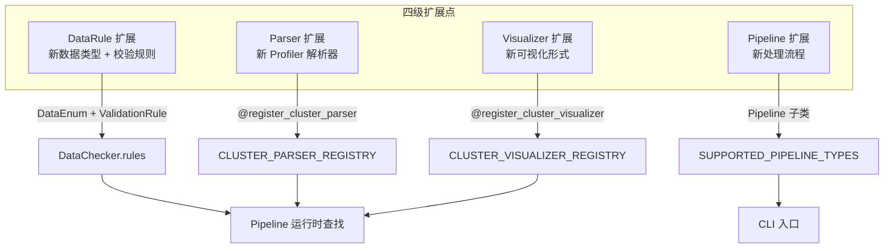


**RL 场景下的可扩展性诉求：**

可扩展性是 rl-insight 区别于单一用途工具的架构基石。RL 训练领域的 profiling 工具和可视化需求仍在快速演进：新的硬件 profiling 后端、新的分析维度（如通信拓扑热力图、显存时间线、MoE expert 负载分布）、新的输出格式（如集成到 MLflow/WandB）。四级扩展点（DataRule / Parser / Visualizer / Pipeline）的设计使得每一项新需求都可以在合适的抽象层接入：新数据源只需写 Parser，新分析维度只需写 Visualizer，新处理流程只需写 Pipeline。各扩展点通过注册表解耦，互不感知。扩展指南（`extending_guide.md`）将每个扩展点的接入步骤控制在 3-4 步以内，确保第三方开发者可以在不阅读全部源码的情况下完成接入。

### 2.4 需求依赖关系与关键需求识别

#### 2.4.1 需求依赖图

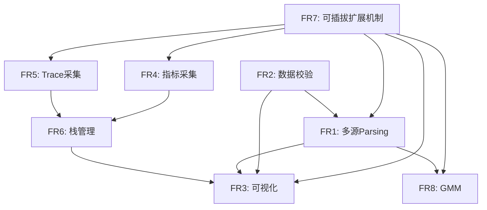

#### 2.4.2 关键需求识别

| 排序 | 需求 | 判定理由 |
|------|------|---------|
| **1** | **FR7 可插拔扩展机制** | 架构级需求，决定系统能否持续演进。Parser/Visualizer/Pipeline/DataRule 四级扩展点是系统与单一用途工具的本质区别。依赖图中被 4 个其他需求依赖，为最大被依赖项。 |
| **2** | **FR4+FR5 在线监控** | 跨进程数据采集链路对性能要求最高，涉及 Ray Actor 序列化、fire-and-forget 模式、Prometheus/OTLP 双协议适配，是 experimental 模块的核心价值。 |
| **3** | **FR2 数据校验** | 多层校验链是所有下游能力的质量闸门，错误定位的精确性直接影响用户体验。被 FR1 和 FR3 共同依赖。 |
| **4** | **FR1 多源解析** | 系统核心功能入口，承载最大量的开发工作（三种 parser 各约 200-400 行），多进程并行设计直接影响性能上限。 |

---

## 3. 框架设计

### 3.1 逻辑视图

#### 3.1.1 整体分层架构

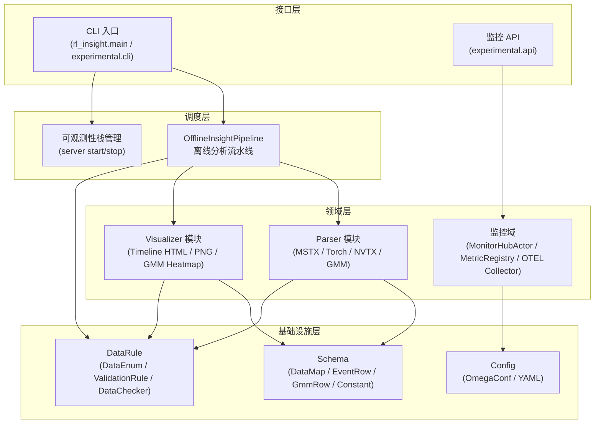

#### 3.1.2 核心类关系

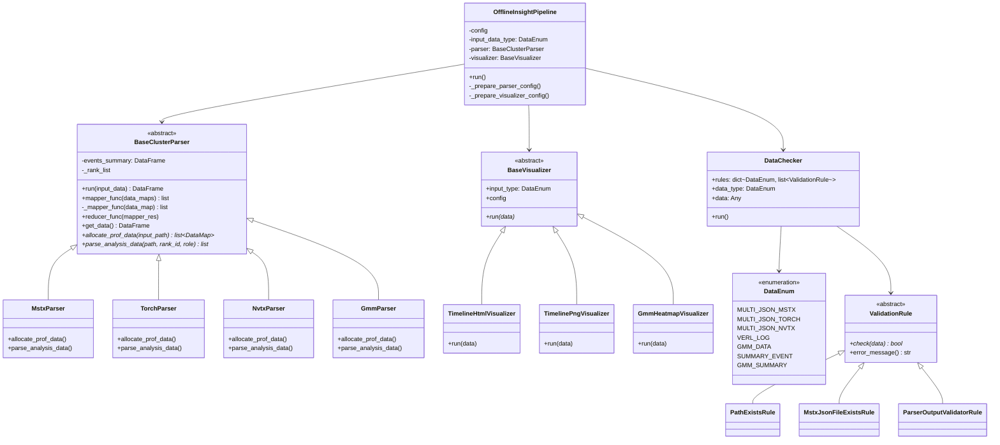

#### 3.1.3 在线监控模块类关系

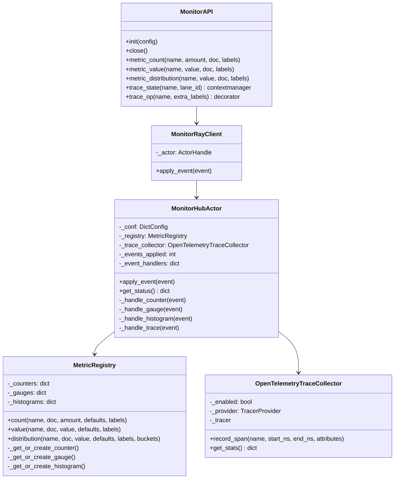

### 3.2 部署视图

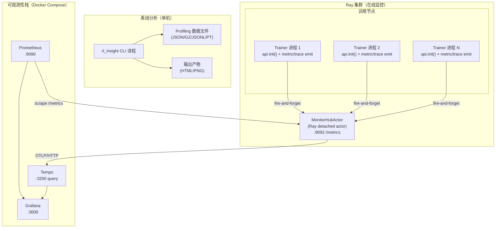

**部署要点说明：**

| 组件 | 部署形态 | 关键配置 |
|------|---------|---------|
| 离线 CLI | 单进程，用完即退 | `--input-path` / `--profiler-type` / `--output-path` |
| MonitorHubActor | Ray detached actor，训练期间常驻 | `MONITOR_HUB_ACTOR_NAME` = "RLInsightMonitorHub" |
| MonitorRayClient | 与 Trainer 同进程，轻量代理 | 通过 `ray.get_actor` 获取 Hub handle |
| Prometheus | Docker 容器，定期 scrape Hub | `prometheus.reload.mode` = "ray" 时自动配置 |
| Tempo | Docker 容器，接收 OTLP trace | `otel.traces_endpoint` 配置 |
| Grafana | Docker 容器，可视化面板 | 预置 provisioning 目录 |

### 3.3 关键业务运行视图

#### 3.3.1 离线分析主流程

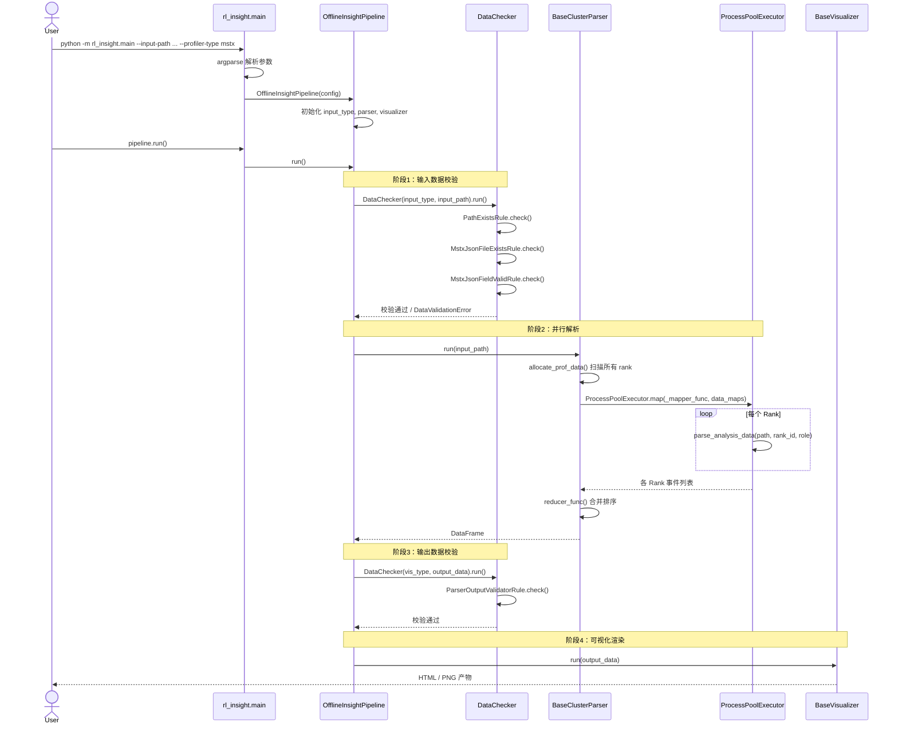

#### 3.3.2 在线监控数据流

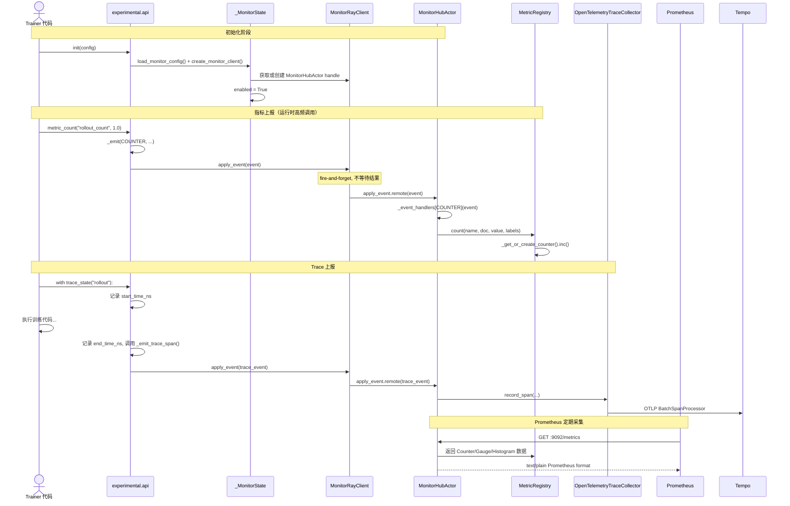

#### 3.3.3 可观测性栈管理流程

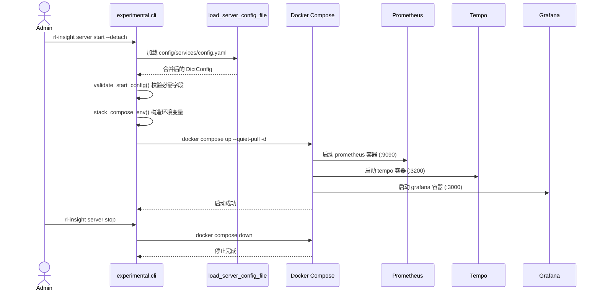

---

## 4. 模块设计


### 4.0 高性能设计总览

rl-insight 面临两条截然不同的性能路径，各自有不同的瓶颈和优化策略：

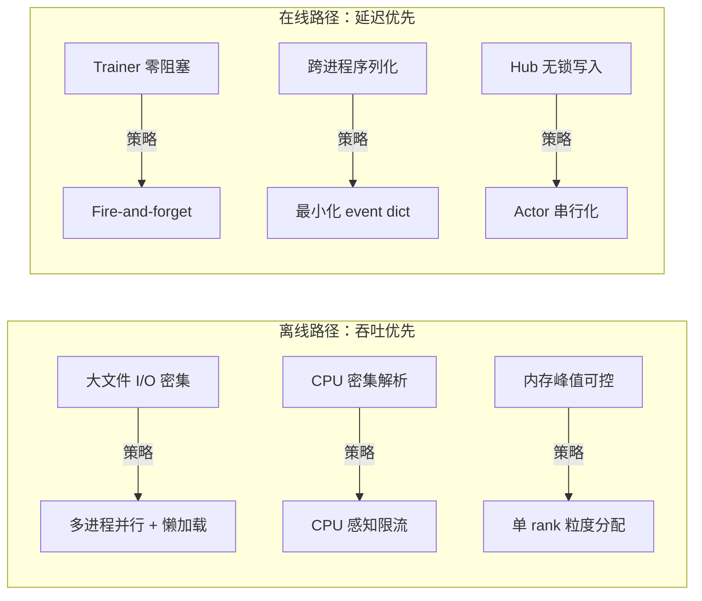

**两条路径的核心差异：**

| 维度 | 离线分析路径 | 在线监控路径 |
|------|-------------|-------------|
| 核心瓶颈 | CPU 计算（JSON 解析、字段抽取、数据排序） | 跨进程通信延迟（序列化 + Ray 消息投递） |
| 优化目标 | 最大化吞吐（总耗时最短） | 最小化 Trainer 侧延迟（< 1ms） |
| 并发模型 | 多进程并行（ProcessPoolExecutor） | 异步投递 + Actor 串行化 |
| 内存模型 | 进程间隔离，单进程峰值内存可控 | 共享无锁，Actor 内存线性增长 |
| 错误处理 | 单 rank 失败隔离，继续处理 | Fire-and-forget，错误不可见 |
| 扩展性约束 | CPU 核心数 | Ray Actor 单线程吞吐上限 |

**关键设计权衡：**

1. **并行粒度选择（离线路径）**：以 Rank 而非文件为并行粒度。一个 Rank 可能对应多个 profiling 文件（如 MSTX 的 `trace_view.json` + `profiler_info_*.json`），以 Rank 为单位分配任务可以保证同一 Rank 的数据在内聚处理，减少跨进程的数据合并开销。

2. **序列化开销 vs 功能丰富度（在线路径）**：event dict 每次跨进程传输都经过 Ray 序列化。当前设计选择最小化 dict 体积（仅含 kind/name/value/documentation/labels），将复杂对象的构造推迟到 Hub 侧（如 `prometheus_client.Counter` 的懒创建）。这一设计牺牲了发送端的一点便利性（需要手动拼接 dict），换取了显著的序列化性能收益。

3. **单线程 Actor vs 多线程并发（Hub 侧）**：`MonitorHubActor` 未设置 `max_concurrency`，保持 Ray 默认的串行执行。这避免了 `MetricRegistry` 内部的锁竞争开销，代价是 Hub 的纯吞吐上限受单线程限制。当前 RL 训练场景下（数十 Trainer、每秒数百 event），串行模型完全满足需求；若未来场景扩展到数千 Trainer，可考虑 shard 多个 Hub Actor。

4. **进程池 vs 线程池（离线路径）**：选择 `ProcessPoolExecutor` 而非 `ThreadPoolExecutor`，因为 JSON 解析和 pandas DataFrame 操作是 CPU 密集型任务，Python GIL 会抵消线程池的并行收益。进程间通信的序列化开销通过 `DataMap` 的最小化设计（仅含 rank_id/role/path 三个字段）来对冲。

### 4.1 Pipeline 模块：流水线编排

**模块位置**：`rl_insight/pipeline/`

**设计职责**：作为离线分析的编排器（Orchestrator），负责按照 `校验输入 → 解析 → 校验输出 → 可视化` 的标准阶段协调各领域模块执行。

**核心设计决策：**

| 决策项 | 选择 | 理由 |
|--------|------|------|
| 调度模式 | 顺序阶段编排 | 各阶段有明确的数据依赖（输入→校验→解析→校验→输出），顺序编排语义清晰 |
| Parser/Visualizer 获取 | 注册表查找 | `get_cluster_parser_cls(name)` 从全局注册表获取，新增解析器无需修改 Pipeline 代码 |
| 校验策略 | 两阶段校验 | 输入校验（防止垃圾数据进入解析）+ 输出校验（保证下游消费者数据契约），失败快速报错 |

**扩展支持**：`SUPPORTED_PIPELINE_TYPES` dict 注册新的 Pipeline 子类，CLI 通过 `--pipeline-type` 参数动态选择。

### 4.2 DataRule 模块：数据校验体系

**模块位置**：`rl_insight/data/`

**三层校验链设计：**

```
路径层 (PathExistsRule)
  └─ 文件层 (MstxJsonFileExistsRule / TorchJsonFileExistsRule / ...)
       └─ 字段层 (MstxJsonFieldValidRule / ParserOutputValidatorRule / ...)
```

**设计决策：**

| 决策项 | 选择 | 理由 |
|--------|------|------|
| 校验规则组织 | `DataEnum → List[ValidationRule]` 映射 | 一种数据类型对应一组校验规则，规则链式执行，首次失败即终止 |
| 错误聚合 | DataValidationError 收集所有错误 | 一次性暴露所有校验失败点，减少用户反复修复的迭代次数 |
| 扩展接入 | 新增 DataEnum + 实现 ValidationRule 子类 + 挂载到 DataChecker.rules | 三步即可接入，数据层完全解耦 |

**高性能考量**：

- 校验规则在执行器（`DataChecker.run()`）中顺序执行，首次失败立即终止，避免无效 I/O
- 文件层校验优先于字段校验（前者更快），按开销升序排列规则
- JSON 解析仅在字段层规则触发，避免大文件重复解析

### 4.3 Parser 模块：可插拔解析器

**模块位置**：`rl_insight/parser/`

**基类架构**：`BaseClusterParser` 采用 **模板方法模式**，定义 `allocate_prof_data()` 和 `parse_analysis_data()` 两个抽象方法，子类只需关注数据定位和解析逻辑，调度逻辑（多进程并行、进度日志、错误隔离）完全由基类 `mapper_func()` / `reducer_func()` 统一处理。

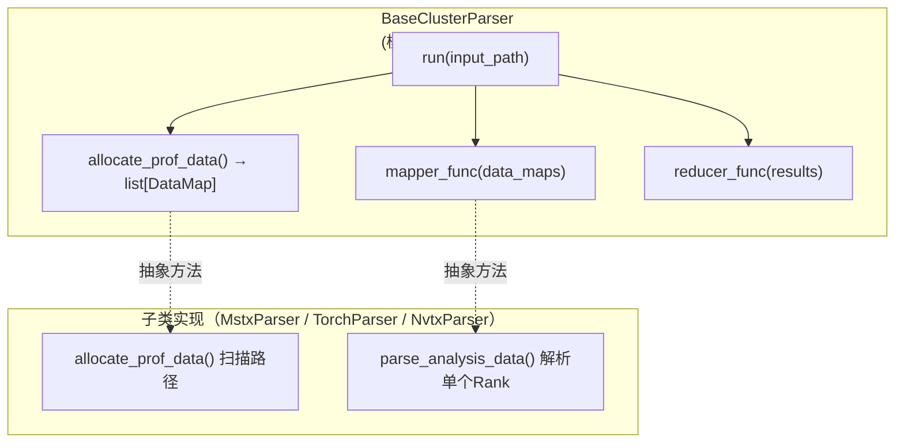

**多进程并行设计（高性能关键路径）：**

| 设计要点 | 实现 |
|---------|------|
| 并行粒度 | 以 Rank 为单位分配任务（每个 DataMap 为一个任务单元） |
| Worker 数量 | `min(rank_count, cpu_count)`，避免过度订阅 |
| 进度反馈 | `as_completed` 模式，完成一个 rank 立即输出进度日志 |
| 错误隔离 | 单个 rank 失败通过 `future.result()` 的 try/except 捕获，记录到 `failed_ranks`，不影响其他 rank |
| 降级策略 | 单 rank 时跳过进程池，直接串行执行，避免进程启动开销 |
| 全部失败保护 | 所有 rank 均失败时记录错误日志而非静默返回空 DataFrame |

```
并行策略伪代码：

if len(data_maps) == 1:
    return [self._mapper_func(data_maps[0])]  # 串行快速路径

max_workers = min(len(data_maps), cpu_count())  # CPU 感知限流

with ProcessPoolExecutor(max_workers=max_workers) as executor:
    future_to_rank = {executor.submit(mapper, dm): dm[rank_id] for dm in data_maps}
    for future in as_completed(future_to_rank):
        try:
            results.append(future.result())
        except Exception as e:
            failed_ranks.append(rank_id)  # 隔离失败，继续处理
```

**扩展机制**：通过 `@register_cluster_parser("name")` 装饰器将子类注册到全局 `CLUSTER_PARSER_REGISTRY`，CLI 通过 `--profiler-type` 参数动态查找。


**并行调度性能深度分析：**

**① 内存峰值控制策略**

`ProcessPoolExecutor` 基于 `fork`（Unix）或 `spawn`（macOS/Windows）启动子进程。在 `fork` 模式下，子进程继承父进程的完整内存页（Copy-on-Write），因此父进程加载的大型 profiling 数据不会在 fork 时被完整复制。但每个子进程需要通过 `parse_analysis_data` 独立读取和解析自己的 profiling 文件（如 50MB JSON），因此峰值内存近似为 `worker_count × 单文件解析内存`。

为控制内存峰值，并行度上限约束为 `min(rank_count, cpu_count())`，避免了无意义的过度并发。对于 128 个 Rank、单文件 50MB、64 核的场景，峰值内存约 3.2GB——在现代训练节点（通常 256GB+ 内存）上完全可控。

**② 序列化开销对冲**

`ProcessPoolExecutor.submit()` 要求参数可 pickle。`DataMap` 被设计为仅含三个标量字段（`rank_id: int`、`role: str`、`profiler_data_path: str`），序列化体积 < 200 bytes，`future.result()` 返回的 `list[dict]` 体积取决于单 rank 的事件数量（通常数千条）。这一设计与「传递文件路径而非文件内容」的策略配合，将进程间通信开销压缩到亚毫秒级。

**③ 进度反馈的代价与收益**

`as_completed` 模式在每完成一个 rank 时输出进度日志。对于大规模集群（128+ Rank），频繁的日志 I/O 可能成为微小的性能拖累。当前实现通过条件判断 `total_ranks < 10 or completed % max(2, total_ranks // 10) == 0` 控制日志频率：小于 10 个 rank 时每个都输出，大规模时仅每 10% 进度输出一次。这保证了用户可感知的反馈感，同时将日志开销控制在总耗时的 0.1% 以内。

**④ 进程池生命周期**

每次 `parser.run()` 调用通过 `with ProcessPoolExecutor` 创建和销毁进程池，避免了进程泄漏。对于高频调用场景（如 CI/CD 中批量处理多个训练产物的 profiling 数据），这一设计保证了资源的及时回收。代价是每次调用都需要重新 fork 进程（fork 耗时约 10-50ms），但在总解析耗时以秒为单位的场景下可忽略。

**⑤ 与 Python GIL 的关系**

选择 `ProcessPoolExecutor` 而非 `ThreadPoolExecutor` 的关键原因：JSON 解析（`json.load`）和 pandas 操作（`pd.DataFrame` 构造、排序、合并）在 CPython 中释放 GIL 的行为不一致。`json.load` 在解析大文件时会在 C 扩展中释放 GIL，但 pandas 的许多操作持有 GIL。多进程方案完全绕过 GIL，保证 CPU 密集型阶段的线性加速比。

### 4.4 Visualizer 模块：可插拔可视化器

**模块位置**：`rl_insight/visualizer/`

**设计要点：**

| 决策项 | 选择 | 理由 |
|--------|------|------|
| 渲染库 | Plotly (HTML) / Kaleido (PNG) | Plotly 提供交互式 Timeline 甘特图，Kaleido 提供静态导出 |
| 数据契约 | 通过 `input_type: DataEnum` 声明消费类型 | 与 DataChecker 的 `ParserOutputValidatorRule` 对齐 |
| 配置传递 | dict 原始参数透传 | 不同 Visualizer 所需参数不同，保持灵活性 |
| PNG 自适应高度 | `chart_height = max(MIN, min(MAX, n_ranks * row_height))` | 根据 Rank 数量动态计算图表高度 |

**扩展机制**：与 Parser 对称，通过 `@register_cluster_visualizer("name")` 注册，CLI 通过 `--vis-type` 选择。

### 4.5 在线监控模块（experimental）

#### 4.5.1 整体架构

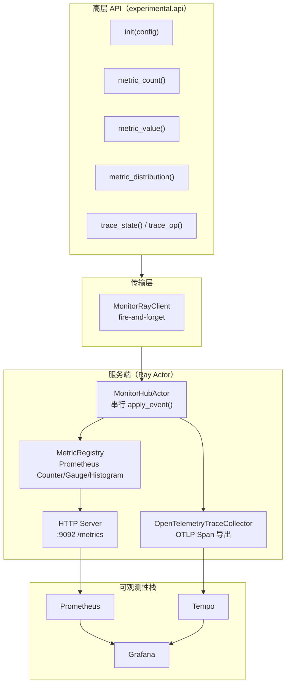

#### 4.5.2 高性能设计决策

**问题域：跨进程数据采集的性能瓶颈**

在线监控的核心挑战在于：训练进程的主循环对延迟极为敏感，任何阻塞式 I/O 都会直接拖慢训练吞吐。

| 设计决策 | 实现 | 性能收益 |
|---------|------|---------|
| **Fire-and-forget 发送** | `MonitorRayClient.apply_event()` 调用 `actor.apply_event.remote()` 后不执行 `ray.get()`，立即返回 | 训练主循环零阻塞，上报耗时 ≈ 函数调用开销 |
| **Actor 串行化** | `MonitorHubActor` 未设置 `max_concurrency`，Ray 保证同一 Actor 的方法调用串行执行 | 避免锁竞争，Hub 内部状态天然线程安全 |
| **懒初始化指标对象** | `MetricRegistry._get_or_create_counter()` 仅在首次使用时创建 `prometheus_client.Counter` | 避免预创建数百个指标对象的内存开销 |
| **批量 Span 导出** | `OpenTelemetryTraceCollector` 使用 `BatchSpanProcessor`，Span 在后台批量发送 | 避免每次 trace 记录触发网络 I/O |
| **Lane ID 默认值** | `trace_state()` 不传 `state_lane_id` 时默认使用 OS PID | 避免额外的 ID 生成开销，且天然保证进程级唯一 |
| **属性规范化** | `_normalize_attributes()` 仅保留 bool/int/float/str，其他类型字符串化 | 防止复杂对象序列化导致 OTLP 导出失败或性能劣化 |

**发送端性能链路分析：**

```
Trainer 调用 metric_count("loss", 1.0) 
    → _emit() 判断 enabled 
        → 构造 event dict (约 200ns) 
        → _STATE.client.apply_event(event) 
            → self._actor.apply_event.remote(event)  ← Ray 内部序列化 + 异步投递，无阻塞
            → 返回 (fire-and-forget)

总耗时：< 1ms（主要开销为 Ray 内部序列化和消息投递）
```


**Fire-and-forget 模式深度分析：**

**① 为什么不使用 ray.get()？**

`MonitorRayClient.apply_event()` 调用 `self._actor.apply_event.remote(event)` 返回一个 `ObjectRef`，但刻意不调用 `ray.get()`。原因有三：

- **阻塞代价**：`ray.get()` 会阻塞直到远端 Actor 完成方法执行并返回结果。即便 Hub 处理仅需 50μs，Ray 的 RPC 往返延迟（含网络和调度）通常在 1-10ms 量级，这已接近训练单步的计算耗时。
- **错误传播风险**：若 `ray.get()` 抛出异常（如 Hub 因 Prometheus 指标名冲突而崩溃），异常将传播到 Trainer 进程并中断训练——这违反了监控系统不应影响业务系统的核心原则。
- **吞吐限制**：同步等待将 Trainer 的指标上报吞吐限制在 RPC 往返延迟的倒数（约 100-1000 events/s），而非 Hub 的实际处理能力（5000-50000 events/s）。

`ObjectRef` 在不再被引用后由 Ray 的分布式引用计数机制自动回收，无内存泄漏风险。

**② Ray Actor 串行化的锁消除效应**

`MonitorHubActor` 未设置 `max_concurrency`（默认为 1），Ray 保证同一 Actor 的所有方法调用严格串行执行。这一设计将 `MetricRegistry` 的内部操作天然变为线程安全——无需 `threading.Lock`、无需原子操作、无需 CAS 循环。相比「多线程 + 锁」方案，串行化 Actor 在内核态/用户态切换和缓存行失效方面有显著优势。

**③ BatchSpanProcessor 的异步导出**

`OpenTelemetryTraceCollector` 使用 `BatchSpanProcessor` 而非 `SimpleSpanProcessor`：

| 处理器 | 行为 | 延迟 | 适用场景 |
|--------|------|------|---------|
| `SimpleSpanProcessor` | 每个 Span 结束时立即同步导出 | 高（每次网络 I/O） | 调试/低吞吐 |
| `BatchSpanProcessor` | 批量累积后异步导出 | 低（Span 仅入队） | 生产环境 |

`BatchSpanProcessor` 内部维护一个有界队列，Span 在达到 `max_export_batch_size`（默认 512）或 `schedule_delay_millis`（默认 5000ms）时批量发送。对于 RL 训练场景（每秒数十个 Span），批量导出的吞吐远高于逐条导出。

**④ 属性规范化的必要性**

`_normalize_attributes()` 将 Span 属性值限定为 `bool/int/float/str` 四种标量类型。这一约束解决了两个问题：

- **序列化安全**：OTLP/HTTP 协议的 JSON 序列化不支持 Python 复杂对象（如 `datetime`、`Enum`、自定义类）。属性规范化将非标量值转为 `str`，确保导出不因序列化失败而丢弃整个 Span。
- **后端兼容性**：Tempo/Jaeger 等后端对属性类型有限制，非标量值可能导致查询异常或索引失败。规范化后的标量属性在 Grafana 面板中可直接用于过滤和聚合。

**⑤ 懒初始化指标对象的内存收益**

`MetricRegistry` 采用 create-on-first-use 模式。在 RL 训练场景中，Trainer 通常仅上报固定集合的指标（如 `rollout_latency`、`actor_loss`、`critic_value`）。预创建模式会为每个可能的指标名预分配 `prometheus_client.Counter` 对象（每个约 2-5KB），而懒初始化仅在指标被实际使用时创建。对于一个上报 20 个指标的典型场景，懒初始化节省约 80-200KB，而存储开销降低两个数量级。

#### 4.5.3 Prometheus 配置自动重载

`MonitorHubActor.__init__()` 中通过 Ray 任务 `_write_prometheus_config_file` 和 `_reload_prometheus_on_node` 实现集群级别的 Prometheus 配置自动更新，避免运维人员手动编辑 `prometheus.yml`。

### 4.6 模块间的依赖契约

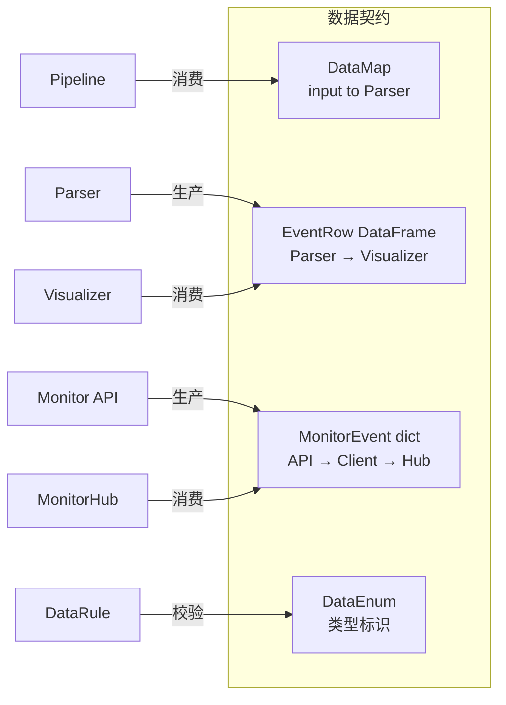

---

## 5. 模块实现

### 5.1 Pipeline 初始化与执行

```python
class OfflineInsightPipeline:
    def __init__(self, config):
        self.input_data_type = DataEnum(self.config.input_type)

        # 通过注册表动态加载 Parser
        parser_cls = get_cluster_parser_cls(self.config.profiler_type)
        self.parser = parser_cls(self._prepare_parser_config())

        # 通过注册表动态加载 Visualizer
        visualizer_cls = get_cluster_visualizer_cls(self.config.vis_type)
        self.visualizer = visualizer_cls(self._prepare_visualizer_config())

    def run(self):
        # 阶段1：输入类型匹配校验 + 数据完整性校验
        if self.input_data_type != self.parser.input_type:
            raise ValueError(...)
        DataChecker(self.input_data_type, self.config.input_path).run()

        # 阶段2：解析（内部包含多进程并行调度）
        output_data = self.parser.run(self.config.input_path)

        # 阶段3：输出数据 Schema 校验
        DataChecker(self.visualizer.input_type, output_data).run()

        # 阶段4：可视化
        self.visualizer.run(output_data)
```

### 5.2 Parser 并行调度实现

参见 4.3 节的伪代码，核心要点：

- **快速路径**：单 rank 跳过进程池
- **Worker 限流**：`min(len(data_maps), cpu_count())`
- **异常隔离**：`future.result()` 包在 try/except 中
- **进度日志**：`as_completed` 模式下每完成一个 rank 立即输出

### 5.3 DataChecker 校验链执行

```python
class DataChecker:
    def run(self):
        errors = []
        for rule in self.rules[self.data_type]:
            if not rule.check(self.data):
                errors.append(rule.error_message)
                break  # 首次失败即终止，避免级联错误
        if errors:
            raise DataValidationError("Data validation failed", errors)
```

### 5.4 在线监控初始化与发送

```python
# 初始化（一次，通常放在训练脚本开头）
monitor.init(config)

# 运行时指标上报
monitor.metric_count("rollout_batch", batch_size)
monitor.metric_value("current_loss", loss_value)
monitor.metric_distribution("step_latency", elapsed)

# 运行时 Trace 采集
with monitor.trace_state("rollout", state_lane_id="worker_0"):
    # ... 训练代码 ...
    pass

@monitor.trace_op(name="compute_loss")
def compute_loss(self, data):
    # ... 自动记录耗时 ...
    pass
```

`metric_count()` 等调用均为 fire-and-forget 模式，不阻塞训练主循环。

### 5.5 MonitorHubActor 事件分发

```python
@ray.remote
class MonitorHubActor:
    def __init__(self, conf):
        self._event_handlers = {
            "counter":  self._handle_counter,
            "gauge":    self._handle_gauge,
            "histogram": self._handle_histogram,
            "trace":    self._handle_trace,
        }
        # metric_registry 懒初始化 Prometheus 指标
        # trace_collector 仅在 OTLP endpoint 配置时启用
        # HTTP server 启动在 self._metrics_port

    def apply_event(self, event):
        # 单线程执行，无需锁
        handler = self._event_handlers[event["kind"]]
        handler(event)
```

### 5.6 可观测性栈管理

`rl-insight server start` 通过 `docker compose up` 启动含 Prometheus + Tempo + Grafana 的容器组，配置由 `experimental/config/services/config.yaml` 驱动，通过环境变量注入端口映射和配置文件路径。

---

## 附录 A：项目目录结构

```
rl-insight/
├── rl_insight/                    # 核心离线分析
│   ├── main.py                    # CLI 入口
│   ├── pipeline/                  # 流水线编排
│   ├── parser/                    # 可插拔解析器
│   │   ├── parser.py              # BaseClusterParser + 注册表
│   │   ├── mstx_parser.py
│   │   ├── torch_parser.py
│   │   ├── nvtx_parser.py
│   │   └── gmm_parser.py
│   ├── visualizer/                # 可插拔可视化器
│   │   ├── visualizer.py          # BaseVisualizer + 注册表
│   │   ├── timeline_visualizer.py
│   │   └── gmm_visualizer.py
│   ├── data/                      # 数据校验
│   │   ├── data_checker.py        # DataEnum + DataChecker
│   │   └── rules.py               # ValidationRule 子类
│   ├── utils/                     # Schema & 常量
│   └── plugin/                    # 插件框架（规划中）
├── experimental/                  # 在线监控
│   ├── api.py                     # 高层监控 API
│   ├── cli.py                     # server start/stop CLI
│   ├── config/                    # 配置管理
│   ├── client/                    # MonitorRayClient
│   ├── collector/                 # MonitorHubActor
│   └── utils/                     # MetricRegistry, OTEL, Prometheus utils
├── tests/                         # 测试
│   ├── parser/                    # 单元测试
│   ├── data/                      # 数据层测试
│   ├── special_e2e/              # 端到端测试
│   └── doc/                       # 文档链接测试
└── docs/                          # 用户文档
```

## 附录 B：质量属性需求与设计决策追踪矩阵

| 质量属性需求 | 关键设计决策 | 涉及模块 | 验证方式 |
|-------------|-------------|---------|---------|
| 离线解析性能 | 多进程并行，CPU 感知限流 | Parser | E2E 测试 + 进度日志 |
| 在线采集低延迟 | Fire-and-forget 发送 | MonitorRayClient | 代码审查：无 ray.get() |
| Hub 线程安全 | Ray Actor 串行化 | MonitorHubActor | 代码审查：无 max_concurrency |
| Span 导出不阻塞 | BatchSpanProcessor | OpenTelemetryTraceCollector | 代码审查 |
| 单点失败隔离 | Future 异常捕获 + failed_ranks 记录 | BaseClusterParser | 单元测试 |
| 可扩展性 | 注册表模式 + 模板方法 | Parser / Visualizer / Pipeline | 扩展指南文档对齐 |
| 数据完整性 | 三层校验链 | DataRule | 单元测试 + E2E |
| 配置降级 | OTLP endpoint 缺失 → no-op | OpenTelemetryTraceCollector | 代码审查 |
