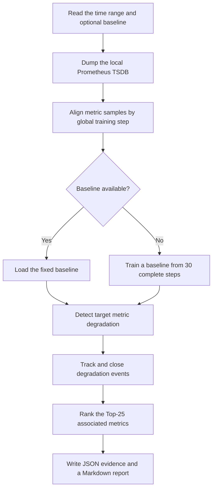

# Offline degradation association

RL-Insight 的离线性能劣化分析模块（包名 `perf_analysis`）。对用户选定的时间
范围，从本地 Prometheus TSDB 执行一次性的劣化检测与关联分析：拟合或加载
KDE 基线、按 3-of-5 规则跟踪 target 事件、对每个最终事件做 Top-25 关联
排序，并把证据与报告落到 `analysis/` 目录。

本模块通过仓库内的 Agent Skill（`degradation-association-offline`）使用。
本文档介绍 Skill 的使用方式与方案原理；算法细节见文末参考文档。

## 使用方式

本模块对应的 Agent Skill 为
[`degradation-association-offline`](../../../.agent/skills/degradation-association-offline/SKILL.md)。
它会定位仓库、执行只读预检、调用 `perf_analysis` 完成分析，并把关联证据转成
紧凑的 Markdown 报告与根因推断。

Skill 位于仓库根，需在 `rl_insight` 仓库根目录执行。默认使用 RL-Insight 本地
Prometheus TSDB（`~/.rl-insight/data/prometheus`），报告根目录默认为
`analysis`。

## Prompt

复制下面的提示词，填入基线来源与检测时间范围即可。时间范围支持 Unix 秒或
带时区的 ISO-8601 时间戳（如 `2026-09-08T09:00:00+08:00`）。

### 中文

```text
使用 degradation-association-offline 技能开启劣化关联监控

基线：<加载已有基线时填写基线文件路径；无可用基线时填写"重新训练基线">
检测时间段：<开始时间> 至 <结束时间>
是否 reset：否
```

示例（重新训练基线）：

```text
使用 degradation-association-offline 技能开启劣化关联监控

基线：重新训练基线
检测时间段：2026-09-08T09:00:00+08:00 至 2026-09-08T12:00:00+08:00
是否 reset：否
```

### English

```text
Start degradation association monitoring

Baseline: <enter the existing baseline file path to load it; if no baseline is available, enter "Retrain baseline">
Detection time range: <start time> to <end time>
Reset: No (default)
```

Example (retrain the baseline):

```text
Start degradation association monitoring

Baseline: Retrain baseline
Detection time range: 2026-09-08T09:00:00+08:00 to 2026-09-08T12:00:00+08:00
Reset: No (default)
```

> `reset` 是给 Skill 的指令，默认 `否`/`No`。

## 输出产物

一次运行会生成以下文件（报告目录为 `analysis/<start>_<end>/`）：

| 文件                 | 内容                                              |
| -------------------- | ------------------------------------------------- |
| `standard_data.json` | 冻结基线（拟合的正常值域，不含原始 30-step 观测） |
| `abnormal_data.json` | 最终事件视图与每个事件的扁平 Top-25 关联记录      |
| `analysis.json`      | 完整分析结果（状态、基线、检测步数、事件数等）    |
| `report.md`          | Skill 生成的 Markdown 关联表与根因推断            |

## Algorithm flow

分析器把本地 RL 训练指标转成按 step 对齐的证据，对照固定基线检测劣化事件，
并排出与每个事件关联最强的指标。



## 参考文档

- Skill 操作指南：[`degradation-association-offline/SKILL.md`](../../../.agent/skills/degradation-association-offline/SKILL.md)
- 算法契约：[`references/algorithm-contract.md`](../../../.agent/skills/degradation-association-offline/references/algorithm-contract.md)
- 指标中文释义：[`metric-name-catalog.md`](../../../docs/monitor/metric-name-catalog.md)
- 根因经验参考：[`references/diagnostic-experience.md`](../../../.agent/skills/degradation-association-offline/references/diagnostic-experience.md)
