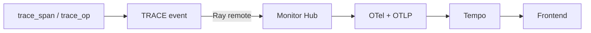
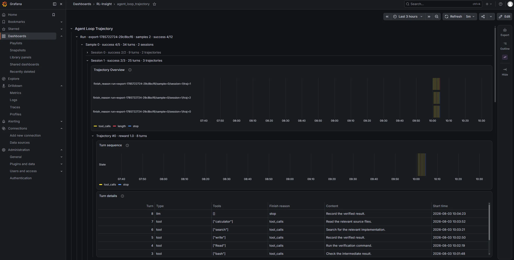

# Trace Interface Developer Guide

This directory contains the minimal integration guide for RL-Insight tracing and `generate_trace_data.py`, an end-to-end validation script.

## Choose the right interface

| Use case | Interface |
|---|---|
| Report a completed Agent Step whose result attributes are known | `trace_span` |
| Measure a model request, tool call, or other function | `trace_op` |
| Measure a black-box Agent that exposes only one process call | `trace_op` |
| Convert timestamped structured events from a black-box Agent | adapter + `trace_span` |

Do not report the same interval with both interfaces. `trace_state` merges overlapping runtime states and is not suitable for one Span per Agent Step.

## Initialize RL-Insight

```python
import ray
import rl_insight as insight

ray.init()
insight.init(
    project="rl-training",
    experiment_name="ppo-run-01",
    config={"server": {"url": "http://<rl-insight-server>:18080"}},
)
```

Call `insight.finish()` before `ray.shutdown()` when the process exits. `finish()` clears local monitor state; it does not flush pending Ray or OpenTelemetry work.

Reporting is fire-and-forget: a successful call means the event was submitted to Ray, not that Tempo has persisted it. Wait for or query the expected Spans before shutting Ray down when persistence must be confirmed.

## Execution flow



`apply_event.remote` does not wait for the Hub, exporter, or Tempo. Each report currently creates an independent root Span; Agent Step correlation relies on attributes rather than parent-child Span relationships.

## Report a white-box Agent Step

Call `trace_span` after the Step completes, when its final state and output are available. The current ReAct `run()` receives only `sandbox` and `messages`, so the task runner must first inject `session_id`, `uid`, `sample_index`, and `session_index` through an execution context or Agent configuration. Do not synthesize these identities inside the Agent.

The smallest useful seam is around the existing `await self.step(...)` call. This integration sketch uses the real ReAct call signature; `extract_step_summary()` and `redact()` are producer-owned policy helpers:

```python
import json
import time

step_state = {
    "completed": ("tool_calls", "continue"),
    "finished": ("finished", "finished"),
    "token_limit": ("token_limit", "token_limit"),
    "timeout_limit": ("timeout_limit", "timeout_limit"),
}

for step_idx in range(1, cfg.max_steps + 1):
    trajectory_info["steps"] = step_idx
    start_time_ns = time.time_ns()
    transcript_start = len(transcript)
    state_name = step_outcome = "error"
    try:
        stop_reason = await self.step(cfg, model, toolbox, transcript, trajectory_info)
        state_name, step_outcome = step_state[stop_reason]
    finally:
        content, tools = extract_step_summary(transcript[transcript_start:])
        insight.trace_span(
            name="agent_step",
            start_time_ns=start_time_ns,
            end_time_ns=time.time_ns(),
            attributes={
                **trace_identity,  # supplied by the task runner
                "step_index": str(step_idx),
                "monitor.trace_source": "agent_step",
                "state_name": state_name,
                "step_outcome": step_outcome,
                "tools": json.dumps(tools, ensure_ascii=False),
                "content": redact(content)[:500],
                "agent_step.timing_source": "execution_time",
            },
        )

    if stop_reason != "completed":
        termination_reason = stop_reason
        break
```

The `finally` block reports an `error` Step and preserves the original exception when `step()` fails. The producer-owned extraction and redaction helpers used there must be best-effort and must not raise. Keep the existing outer exception handling, loop `else`, and episode termination behavior unchanged.

## Measure an operation

Use `trace_op` at a stable function seam such as a model request:

```python
class OpenAICompatibleChatModel:
    @insight.trace_op(
        "react.model_query",
        extra_labels=lambda model: {
            "monitor.trace_source": "operation",
            "operation.type": "model_query",
            "model.name": model.model_name or "unknown",
        },
    )
    async def query(self, messages):
        ...
```

`trace_op` measures the complete synchronous call or asynchronous `await`. Its attributes are resolved before execution, so it cannot read the return value. Use `trace_span` when attributes depend on `finish_reason`, generated content, or the actual tool list.

`extra_labels` receives only the first positional argument. Labels are merged in this order:

```text
static labels → extra_labels(first positional argument)
              → monitor.trace_segment=duration
```

Operation spans may carry `session_id` and `step_index` for correlation, but the frontend must not group them into Agent Step lanes.

## Handle a black-box Agent

- If only a launch-and-wait call is visible, report one run-level `trace_op` Span.
- If the Agent streams timestamped structured events, convert each real event with an adapter and report it through `trace_span`.
- If logs arrive only after completion and contain no timestamps, do not fabricate Step timing.

## Agent Step Span v1

Use the stable Span name `agent_step`. RL-Insight transports attributes but does not generate or validate this producer protocol.

| Attribute | Rule |
|---|---|
| `session_id` | Unique Agent episode ID from `SessionHandle` |
| `uid` | Dataset or task identifier supplied by the task runner |
| `sample_index` | Input sample index encoded as a string |
| `session_index` | Rollout session index encoded as a string |
| `step_index` | ReAct Step index encoded as a string, starting at 1 |
| `monitor.trace_source` | Always `agent_step` |
| `state_name` | `tool_calls`, `finished`, `token_limit`, `timeout_limit`, or `error` |
| `step_outcome` | `continue`, `finished`, `token_limit`, `timeout_limit`, or `error` |
| `tools` | JSON string containing tool names; use `[]` when empty |
| `content` | Redacted summary, limited to 500 characters |
| `agent_step.timing_source` | `execution_time` or `receive_time` |

Map the current ReAct `stop_reason` values as follows:

| `stop_reason` | `state_name` | `step_outcome` |
|---|---|---|
| `completed` | `tool_calls` | `continue` |
| `finished` | `finished` | `finished` |
| `token_limit` | `token_limit` | `token_limit` |
| `timeout_limit` | `timeout_limit` | `timeout_limit` |
| exception | `error` | `error` |

Optional attributes include `model.finish_reason`, `model.prompt_tokens`, `model.completion_tokens`, `tool.call_count`, `tool.error_count`, `tool.timeout_count`, and `agent.termination_reason`. Model, Step, and episode completion reasons must remain separate.

Attribute values must be OpenTelemetry scalars (`str`, `bool`, `int`, or `float`) or homogeneous scalar sequences. Encode nested data explicitly. Do not copy full messages, tool arguments, observations, token IDs, logprobs, or aggregate statistics into every Span.

RL-Insight automatically adds `process_id` and, when configured, `project` and `experiment_name`. Producers should not override them.

An Agent Step and a Gateway `Trajectory` are different domain objects. Gateway trajectories are materialized only after the Session finishes; do not require `trajectory_index` on live Step Spans.

## Frontend lane grouping

Agent Step producers must not report `state_lane_id`. The frontend derives it from `session_id`:

```typescript
function makeStateLaneId(span: AgentStepSpan): string {
  return span.session_id;
}

function makeStepId(span: AgentStepSpan): string {
  return `${span.session_id}/step=${span.step_index}`;
}
```

Group Steps by lane and sort them numerically by `step_index`. The `state_lane_id` parameter of `trace_state()` remains a separate runtime-state concept.

## Validate the integration

With RL-Insight, Tempo, and Grafana running:

```bash
python rl_insight/experimental/generate_trace_data.py \
  --server-url http://127.0.0.1:18080
```

The script validates direct `trace_span`, synchronous `trace_op`, and asynchronous `trace_op` reporting through both Tempo and Grafana's Tempo datasource. Decorator-generated Agent Steps are interface tests only; production Agents should follow the selection table above. The same process also publishes an Agent Loop fixture for the dashboard in the next section (`rl_insight_monitor_agent_loop_*_info` / turn unixtime gauges via the metrics HTTP port, plus Tempo turn spans). Leave the process running after verify so Prometheus can keep scraping those gauges.

Useful options are `--tempo-url`, `--grafana-url`, `--step-duration`, and `--timeout`. The script checks Span count, names, required attributes, and uniqueness of `session_id/step_index`, then prints the generated `session_id` values and Grafana Explore URL.

## Agent Loop trajectory visualization

Dashboard JSON: `rl_insight/config/services/grafana/dashboards/agent_loop_trajectory.json` (title `agent_loop_trajectory`). It uses Grafana nested Repeat with section-scoped Query variables (`dashboardSectionVariables` in `grafana.ini`).

```text
Prometheus  rl_insight_monitor_agent_loop_{run,sample,session,traj}_info
            rl_insight_monitor_agent_loop_{first,last}_turn_unixtime
        →   nested Repeat rows (titles from each `*_info` `title` label)

Tempo       turn spans keyed by `state_lane_id` (and `run_id`, …)
        →   Trajectory Overview / Turn sequence / Turn details
```

`$run_id` / `$has_agent_loop_data` select runs whose turn activity overlaps the dashboard time range (`first_turn_unixtime` / `last_turn_unixtime` vs `$__from` / `$__to`). Nested `$sample` / `$session` / `$traj` enumerate children under the selected parent.

**Effect** (example after `generate_trace_data.py` verify; Grafana UID `a1b2c3d4-e5f6-7890-abcd-ef1234567890`):



